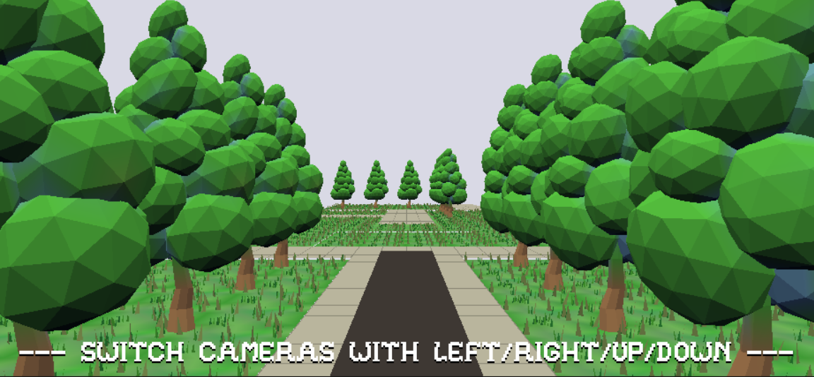

# (Maze game)

Author: (Jiechen Li)

Design: (TODO: In two sentences or fewer, describe what is new and interesting about your game.)

This is a very big maze!
(It was very big. I built 10 cameras and a 150 * 150 garden with so many trees. But I found my blend file is too large, like 100MB. The script will run more than two hours to produce a new pnct file. So I cut the size to 30MB and the maze is not so big anymore.)
You need to find a way out!

Screen Shot:

How To Play:

You can use your keyboard to control the next step.
'←' means you choose to go left.
'→' means you choose to go right.
'↑' means you choose to go up.
The target of this game to get out of this maze.
If you cannot find the way, or you are in dead end, you can press '↓' to get back to the original position if you want.

Sources:

Art Sources:
https://www.turbosquid.com/3d-models/blender-carrot-crystal-oak-tree-3d-model-1189852

Sound Sources:
https://freesound.org/people/YellowTree/sounds/483907/

This game was built with [NEST](NEST.md).